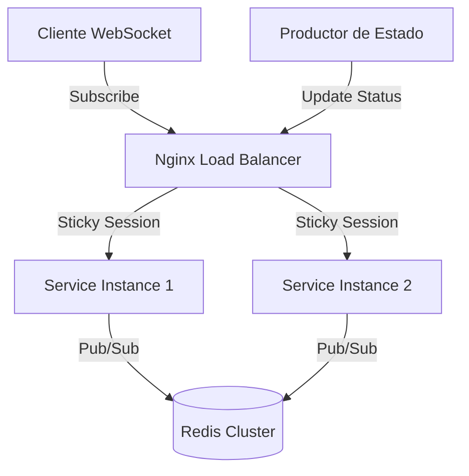

# Process Subscription Service

Servicio de suscripción en tiempo real distribuido, diseñado para monitorear estados de procesos mediante WebSockets y Redis Pub/Sub.

## 🚀 Características

- **Suscripción en Tiempo Real**: WebSockets para recibir actualizaciones instantáneas.
- **Arquitectura Distribuida**: Escalable horizontalmente usando Redis como backbone de mensajería.
- **Modo Desarrollo**: Funciona sin dependencias externas (usando memoria RAM) para pruebas rápidas.
- **Resiliencia**: Manejo de desconexiones, heartbeats y limpieza de recursos distribuidos.
- **Observabilidad**: Métricas Prometheus y Health Check detallado.
- **Documentación API**: Swagger integrado.

## 📋 Requisitos Previos

Para ejecutar este servicio necesitas:

- **Go 1.21+**
- **Redis 7.0+** (Opcional en modo desarrollo)
- **Docker & Docker Compose** (Para despliegue en producción)

## 🛠️ Instalación y Configuración

1.  **Clonar el repositorio**
    ```bash
    git clone <url-del-repo>
    cd suscriber
    ```

2.  **Instalar dependencias**
    ```bash
    go mod tidy
    ```

3.  **Configurar variables de entorno**
    Crea un archivo `.env` en la raíz (puedes copiar `.env.example`):
    ```env
    PORT=8080
    REDIS_ADDR=localhost:6379
    # Poner en 'true' para probar sin Redis
    DEVELOP_STATUS=true
    ```

## 🏃‍♂️ Ejecución

### Modo Local (Desarrollo)
Sin necesidad de Redis (usa memoria):
```bash
# Asegúrate de tener DEVELOP_STATUS=true en tu .env
go run cmd/subscription-service/main.go
```

Con Redis local:
```bash
# Cambia DEVELOP_STATUS=false en tu .env
docker run -d -p 6379:6379 redis:alpine
go run cmd/subscription-service/main.go
```

### Modo Producción (Docker Compose)
Levanta todo el stack (Redis + 3 Instancias + Nginx):
```bash
docker compose up --build -d
```

## 📖 Documentación API (Swagger)

Una vez iniciado el servicio, visita:
👉 [http://localhost:8080/swagger/index.html](http://localhost:8080/swagger/index.html)

### Endpoints Principales

- `GET /subscribe?uuid={uuid}`: Conexión WebSocket para recibir eventos.
- `POST /update-status`: Publicar un cambio de estado.
- `GET /health`: Estado del servicio y conexión a Redis.
- `GET /metrics`: Métricas para Prometheus.

## 🧪 Testing

Ejecutar pruebas unitarias:
```bash
go test ./...
```

Ejecutar prueba de integración (WebSockets):
```bash
# Requiere el servicio corriendo
go run test_websocket.go
```

## 🏗️ Arquitectura


